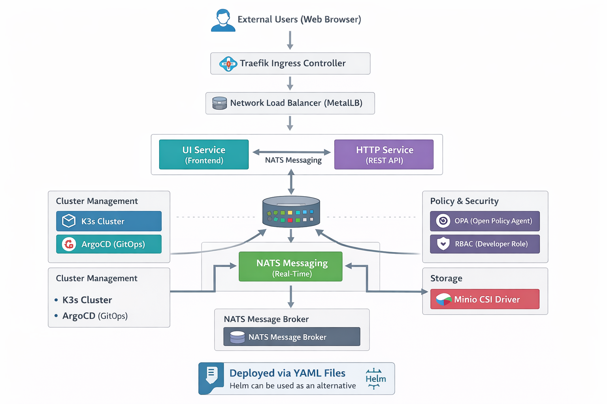

# GitOps-with-ArgoCD

<h2 align="center">High-Level Architecture</h2>

  

## 🧱 Architecture Components

- **K3s** – Lightweight Kubernetes cluster  
- **Traefik** – Ingress controller for routing  
- **NATS** – Event-driven messaging system  
- **WebSocket Service** – Real-time communication  
- **OPA (Open Policy Agent)** – Policy enforcement  
- **RBAC** – Access control  
- **MinIO (CSI)** – Persistent storage  

## 📖 Overview

This project implements an event-driven microservices architecture on K3s using YAML-based deployments. External traffic is routed through Traefik, directing requests to the UI and WebSocket services based on path rules.

The UI service publishes messages to NATS, while the HTTP service subscribes and processes them asynchronously, demonstrating decoupled communication. A WebSocket service enables real-time interactions with clients. Security and governance are enforced using OPA and RBAC, with optional storage support provided by MinIO.

##  Storage Integration using CSI with MinIO**

This project includes a Container Storage Interface (CSI) integration that connects Kubernetes to MinIO, enabling dynamic and persistent storage provisioning. When a PersistentVolumeClaim (PVC) is created, Kubernetes interacts with the CSI driver, which automatically provisions storage in MinIO in the form of a bucket. This storage is then mounted into the pod as a filesystem, allowing applications to read and write data just like a traditional disk, while ensuring that the data persists independently of the pod lifecycle.

🔧 Install CSI S3 Driver

git clone https://github.com/yandex-cloud/k8s-csi-s3.git
cd k8s-csi-s3/deploy/kubernetes
kubectl apply -f .

## 🔐 Verification: OPA Enforcement, RBAC Restrictions, and NATS Messaging 
📡 NATS Messaging Test

To verify asynchronous communication using NATS, you can simulate a publisher and subscriber inside the cluster.

Start a subscriber:

kubectl run nats-box --image=natsio/nats-box -it --rm -- sh
nats --server nats:4222 sub test.subject

In another terminal, start a publisher:

kubectl run nats-box2 --image=natsio/nats-box -it --rm -- sh
nats --server nats:4222 pub test.subject "hello from ui"

If everything is working correctly, the subscriber will receive and display the message, confirming successful event-driven communication between services.

** 🛡️ RBAC Verification **

To validate Kubernetes Role-Based Access Control (RBAC) restrictions, use the following commands:

kubectl auth can-i create deployments --as=dev-user -n dev

Expected output:

yes
kubectl auth can-i get secrets --as=dev-user -n dev

Expected output:

no

This confirms that the developer role has permission to manage deployments but is restricted from accessing sensitive resources like secrets.

** ⚖️ OPA Policy Enforcement Verification **

To verify policies enforced by Open Policy Agent, attempt to deploy a resource that violates your defined policy (e.g., missing resource limits).

Example:

apiVersion: v1
kind: Pod
metadata:
  name: test-opa
spec:
  containers:
  - name: nginx
    image: nginx

Apply it:

kubectl apply -f test-opa.yaml

Expected result:

The request should be denied by OPA (Gatekeeper)
You will see an error indicating policy violation (e.g., missing resource limits)

This confirms that policy enforcement is active and working as intended.